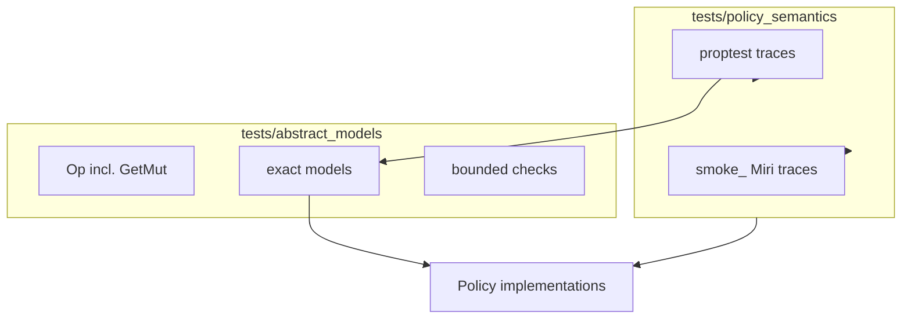

# Policy Semantic Testing (Static Analysis Oracles)

## Overview

This harness is a **test-side abstract interpreter** for eviction policies. It reuses ideas from WCET static cache analysis (ages, residency, must/may hit classification) as **semantic oracles** — not as a program analyzer.

**What it is**

- Reference models under [`tests/abstract_models/`](../../tests/abstract_models/) that predict residency, hit/miss, and victims from access traces ([README](../../tests/abstract_models/README.md))
- Integration tests in `tests/policy_semantics/` that **dual-run** exact/mirror models against real implementations, or run **invariant-only** checks for bounded policies (ARC, CAR, Clock-PRO, S3-FIFO)
- Complements unit tests, in-module property tests, and fuzz targets (correctness only; not bench workloads)

**What it is not**

- A public `cachekit::analysis` API
- WCET analysis of arbitrary Rust CFGs
- Concurrency or performance testing

## Background: WCET concepts reused here

| Concept | Harness use |
|---------|-------------|
| LRU ages (0 = MRU) | Exact `LruOccupancyModel` and `recency_rank` assertions |
| Interval / legal victims | `OracleExpectation::Legal` for adaptive policies (Phase 3b) |
| Must / may hit-miss | `HitMiss::{MustHit,MustMiss,MayHitOrMiss}` |
| Path-sensitive traces | Future work (not yet implemented); dual-impl equivalence ships first |

See [trait hierarchy](../design/trait-hierarchy.md) for `peek` vs `get` vs `touch` semantics asserted by the harness.

## Spec-first oracles

Operational specs in [`specs/`](specs/) are the source of truth. **Canonical policy index:** [matrix.md](specs/matrix.md) (tier, harness mode, models, op strategy, traits).

```text
spec doc → reference/ PolicyModel (optional) → exact/ PolicyModel → implementation dual-run
```

| Harness mode | Tier | Oracle |
|--------------|------|--------|
| DualRun | exact, mirror, composed | `exact/` vs impl |
| CrossModel | exact (all policies with `reference/` models) | `reference/` vs `exact/` |
| InvariantOnly | bounded | structural invariants on impl |

**FIFO + LRU worked example:**

| Layer | FIFO | LRU |
|-------|------|-----|
| Spec | [fifo.md](specs/policies/exact/fifo.md) | [lru.md](specs/policies/exact/lru.md) |
| Reference | `NaiveFifoModel` | `NaiveLruModel` |
| Exact | `FifoModel` | `LruOccupancyModel` |
| Cross-model | `prop_fifo_naive_matches_current_model` | `prop_lru_naive_matches_current_model` |
| Impl dual-run | `prop_fifo_matches_model` | `prop_lru_core_matches_model` |

All exact-tier policies in [matrix.md](specs/matrix.md) now have reference models (LRU-K completes the set). Mirror and bounded policies remain `stub` maturity with invariant-only or dual-run harnesses.

**Failure interpretation:** reference ≠ exact → fix spec or `exact/` model; reference = exact but impl fails → fix implementation or adapter.

FIFO and LRU include optional [TLA+](specs/formal/fifo/Fifo.tla) specs (manual TLC, not CI). Read [tla-guide.md](specs/tla-guide.md); run [`scripts/run-fifo-tlc.sh`](../../scripts/run-fifo-tlc.sh), [`scripts/run-lru-tlc.sh`](../../scripts/run-lru-tlc.sh), or [`scripts/run-tlc.sh`](../../scripts/run-tlc.sh). Runbooks: [formal/fifo/tlc.md](specs/formal/fifo/tlc.md), [formal/lru/tlc.md](specs/formal/lru/tlc.md).

## Architecture



### Core types (`tests/abstract_models/mod.rs`)

| Type | Role |
|------|------|
| `Op<K>` | `Insert`, `Get`, `Peek`, `GetMut`, `Touch`, `Remove`, `EvictOne` |
| `HitMiss` | `MustHit`, `MustMiss`, `MayHitOrMiss` (bounded / TTL only) |
| `PolicyModel<K>` | `apply(op) -> ModelStep` |
| `ModelStep` | `resident`, `hit`, `victim`, `evicted_on_insert` |
| `OracleExpectation<K>` | `Exact(k)`, `Legal(set)`, `None` |

**Peek vs get:** `Peek` must not change `recency_rank`; `Get` / `GetMut` / `Touch` promote on LRU-family policies.

## Policy coverage matrix

| Policy | Model type | Module | Traits asserted | Status |
|--------|------------|--------|-----------------|--------|
| LRU | exact | `exact/lru.rs` | VictimInspectable, RecencyTracking, EvictingCache | done |
| Fast-LRU | exact | `exact/lru.rs` | VictimInspectable, RecencyTracking, EvictingCache | done |
| FIFO | exact | `exact/fifo.rs` | VictimInspectable, EvictingCache | done |
| LIFO | exact | `exact/lifo.rs` | VictimInspectable, EvictingCache | done |
| MRU | exact | `exact/mru.rs` | EvictingCache | done |
| LFU | exact | `exact/lfu.rs` | VictimInspectable, FrequencyTracking, EvictingCache | done |
| Heap-LFU | exact | `exact/heap_lfu.rs` | residency (heap tie-break via `Ord`) | done |
| MFU | exact | `exact/mfu.rs` | residency (`FxHashMap` peek scan) | done |
| LRU-K | exact | `exact/lru_k.rs` | HistoryTracking, EvictingCache | done |
| Clock | exact mirror | `exact/clock.rs` | EvictingCache | done |
| 2Q | exact mirror | `exact/two_q.rs` | residency (no `EvictingCache`) | done |
| SLRU | exact mirror | `exact/slru.rs` | residency | done |
| NRU | exact mirror | `exact/nru.rs` | residency (no explicit `EvictingCache`) | done |
| S3-FIFO | bounded | `bounded/s3_fifo.rs` | `check_invariants`, residency | done |
| ARC | bounded | `bounded/arc.rs` | `debug_validate_invariants` | done |
| CAR | bounded | `bounded/car.rs` | `debug_validate_invariants` (`CarCore`) | done |
| Clock-PRO | bounded | `bounded/clock_pro.rs` | structural checks | done |
| Random | none | — | — | deferred |
| Expiring/TTL | composed | `ttl_integration_test.rs` | `LruOccupancyModel` + deadlines | done |

Bounded **Module** column entries (`bounded/*.rs`) are documentation stubs; tests live in `policy_semantics/*_tests.rs`.

## Running the harness

```bash
# Full matrix (all policy features)
cargo test --test policy_semantics --all-features

# Default features only
cargo test --test policy_semantics

# Single policy proptest
cargo test --test policy_semantics --all-features prop_lru_core_matches_model

# High case count (CI property-tests job)
PROPTEST_CASES=1000 cargo test --test policy_semantics --all-features

# Miri smoke traces (CI miri job)
cargo miri test --test policy_semantics --all-features smoke_ -- --test-threads=1

# TTL layer (uses shared LruOccupancyModel)
cargo test --test ttl_integration_test --features ttl
```

Proptests use `#[cfg_attr(miri, ignore)]`; Miri runs only `smoke_*` hand-written traces.

## Adding a new policy model

See also the [abstract_models contributor checklist](../../tests/abstract_models/README.md#adding-a-new-model).

1. Add model code by tier: exact/mirror → `tests/abstract_models/exact/<policy>.rs` implementing `PolicyModel<K>`; bounded → `tests/abstract_models/bounded/<policy>.rs` doc stub (no `PolicyModel` required today).
2. Cite tie-break / mirror source in the module `//!` doc.
3. Add `tests/policy_semantics/<policy>_tests.rs` with dual-run or invariant-only `run_ops`, plus `smoke_*` + `prop_*`.
4. Gate the module in `tests/policy_semantics/main.rs` with `#[cfg(feature = "policy-…")]`.
5. Append a row to [matrix.md](specs/matrix.md).

Use `op_strategy_no_evict()` when the policy lacks [`EvictingCache`](../../src/traits.rs).

## Model tiers

**Exact** — residency, victim, and rank (where applicable) must match.

**Mirror** — full queue/segment state transcribed from implementation (`TwoQCore`, `SlruCore`, `ClockRing`).

**Bounded** — invariant-only tests assert `len <= capacity` and `debug_validate_invariants` / `check_invariants`. Sibling `bounded/*.rs` files are feature-gated doc stubs. Victim may be a legal set (future).

## Dual-impl equivalence

`tests/policy_semantics/dual_impl_tests.rs`:

- `LruCore` vs `FastLru` — `contains`, `peek_victim`, `recency_rank`
- `ClockCache` vs `ClockRing` — residency agreement

## Debugging failures

1. Re-run the failing `smoke_*` test with `--nocapture`.
2. Shrink with `PROPTEST_CASES=1 cargo test … prop_… -- --nocapture`.
3. Compare model `apply(op)` step to cache state after each op.
4. Check adapter: `Arc<V>` vs `V`, `increment_frequency` vs `touch`, `*k` when matching `&Op`.

## CI integration

- Main `test` job: `cargo test --tests --all-features` (256 proptest cases by default).
- `property-tests` job: `PROPTEST_CASES=1000 cargo test --test policy_semantics --all-features`.
- `miri` job: `cargo miri test --test policy_semantics --all-features smoke_`.

## Related documentation

- [Operational policy specs](specs/README.md) — spec-first source of truth
- [Abstract models README](../../tests/abstract_models/README.md) — directory layout and policy matrix
- [Testing strategy](testing.md) — four test layers including policy semantics
- [Trait hierarchy](../design/trait-hierarchy.md) — capability traits used as oracles
- [Policy catalog](../policies/README.md) — semantic oracle column
